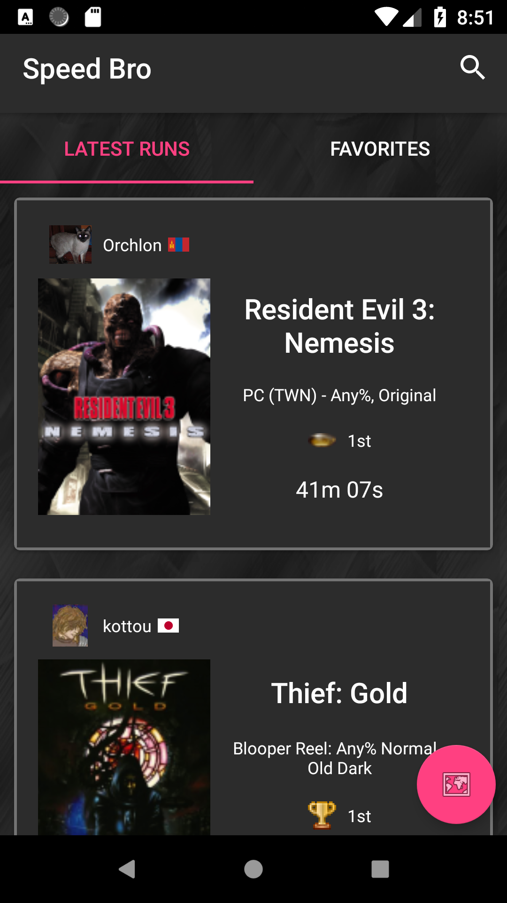
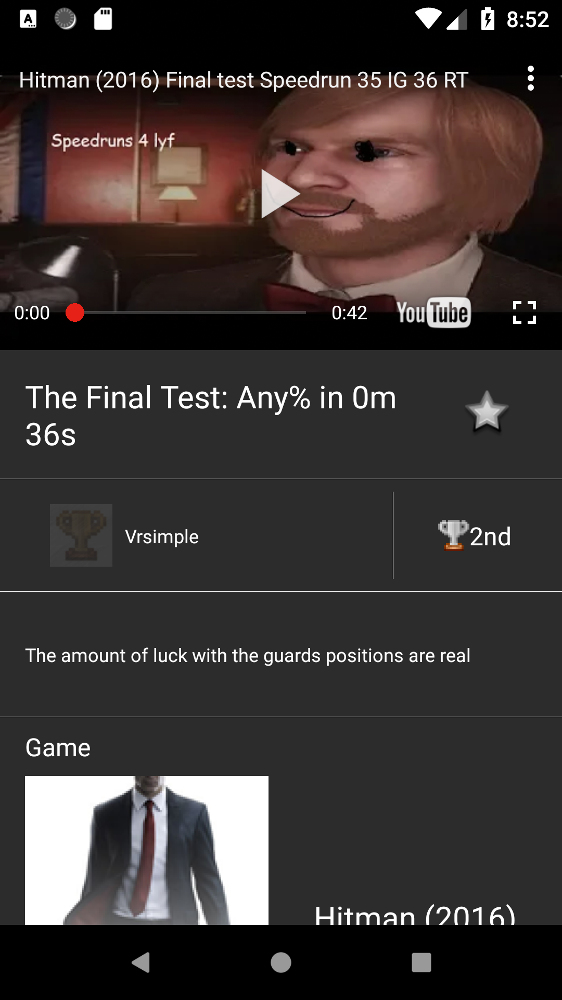
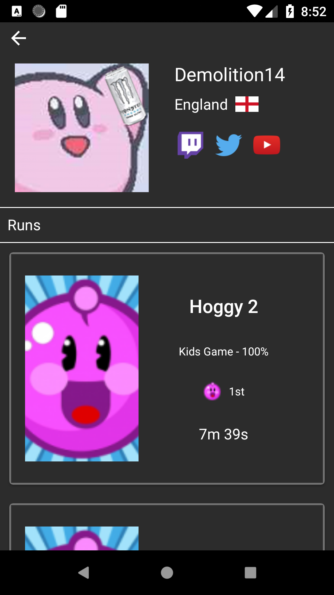
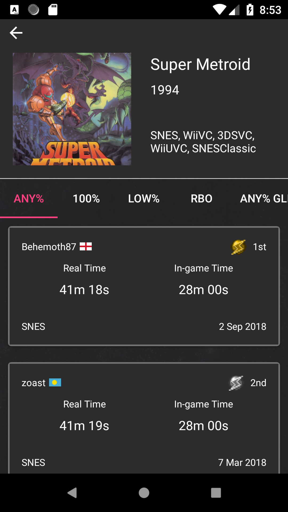

# Speed Bro - Unofficial Speedrun.com browser


[](https://www.travis-ci.org/Artenes/speedbro)

<a href='https://play.google.com/store/apps/details?id=io.github.artenes.speedbro&pcampaignid=MKT-Other-global-all-co-prtnr-py-PartBadge-Mar2515-1'></a>

Browsing application that allows the user to navigate through games, speed runs and users available at [https://www.speedrun.com](https://www.speedrun.com).

# Features

- Browse through the latest runs
- Favorite runs
- See the latest runs in a map view
- Browse the runs of a game
- Browse the runs of a runner
- What the runs directly on the app (if the run is hosted on youtube)
- Search for games and runners

# Notes

- The apps scraps the speedrun.com website, it does not make use of its API
- It plays videos hosted on Youtube using the Youtube API. If the video is hosted on Twitch the Twitch app is opened to play the video.
- It uses the Google Maps library to display runs around the world
- It uses FireBase Crashlytics and Events Analytics
- It is configured to run on [travis-ci.org](https://travis-ci.org/) 

# Screenshots

<p float="left" align="center">
  
   
</p>

<p float="left" align="center">
  
   
</p>

# Set up

Requirements

- Have an API key for Youtube ([How to get a Google Maps API key](https://developers.google.com/maps/documentation/android-sdk/signup))
- Have an API key for Google Maps ([How to get a Youtube API key](https://developers.google.com/youtube/android/player/register))
- Have a google-services.json file from FireBase ([How to get google-services.json from my project in FireBase](https://support.google.com/firebase/answer/7015592)) 

1. Add the following lines to the gradle.properties in your user directory (``~/.gradle`` for linux or ``C:\Users\{you}\.gradle`` for Windows). If neither the file or directory exists, just create it.

````
SpeedBro_YoutubeAPIKey="{your-youtube-api-key}"
SpeddBro_MapsAPIKey={your-maps-api-key}
````

Replace ``{your-youtube-api-key}`` with your Youtube API key and ``{your-maps-api-key}`` with your Google Maps API key. Note that the Youtube key is surrounded by quotes, while the Google Maps one is not. 

2. Clone the project
```
git@github.com:Artenes/speedbro.git
```

3. Copy the google-services.json file to the ``app`` folder

4. Import project in Android Studio

5. Run the app on a device or emulator

# License

Creative Commons Attribution-NonCommercial 4.0 International Public License